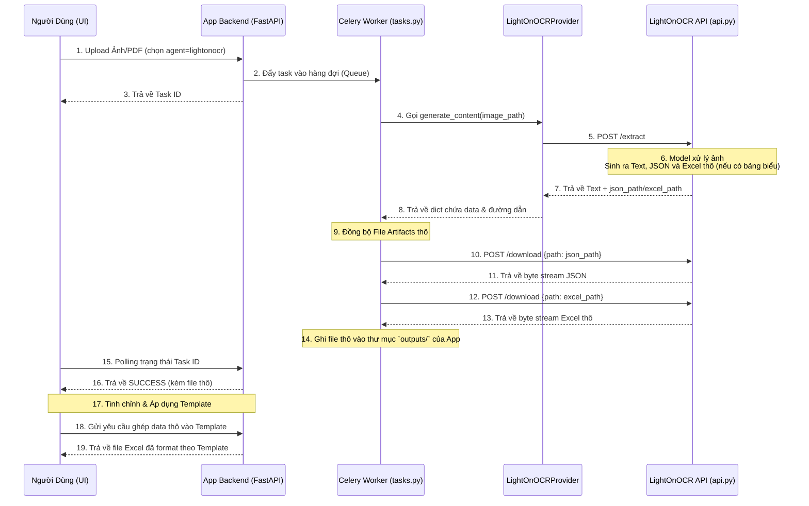

# Kế Hoạch Tích Hợp: Hệ Thống App Chính & LightOnOCR API

Tài liệu này mô tả chi tiết luồng xử lý (Data Flow) dự kiến để kết nối hệ thống App chính (`app/`) với server API nhận dạng chữ (`LightOnOCR-2-1B/api.py`). Mục tiêu là giữ cho cấu trúc tách bạch: **App quản lý giao diện và lưu trữ**, trong khi **LightOnOCR chỉ làm nhiệm vụ tính toán chuyên sâu**.

---

## Sơ đồ luồng xử lý (Workflow)

---

## Chi tiết các bước thực hiện

### Giai đoạn 1: Giao Diện Tách Biệt & Trích Xuất (Steps 1-8)
1. **Giao diện người dùng (Front-facing UI)**: Được thiết kế tinh gọn tối đa dành cho end-user. Người dùng chỉ thấy duy nhất một khu vực tải file cho phép **upload một file ảnh, một file PDF, hoặc chọn nguyên một thư mục (folder) chứa nhiều ảnh**, kèm theo một dropdown/menu để **chọn Template Trích Xuất** (ví dụ: Hoá đơn, Căn cước, Biểu mẫu...).
2. **Giao diện cấu hình (Admin/Settings UI)**: Là một màn hình riêng biệt (ví dụ `/ui/settings`). Nơi đây dùng để thiết lập ngầm các tham số phức tạp: chọn agent (`lightonocr`), điền Base URL của API, cấu hình API Key, bật/tắt yêu cầu xuất file JSON/Excel. End-user khi thao tác ở màn hình chính sẽ tự động kế thừa cấu hình này mà không cần biết cấu hình bên dưới.
3. Khi end-user tải file lên, chọn template trích xuất và ấn xử lý, Celery Worker nhận task. Do hệ thống đã được cấu hình từ màn Settings dùng `agent=lightonocr`, Worker tự động gọi class `LightOnOCRProvider`.
4. `LightOnOCRProvider` lấy file (hoặc danh sách file nếu là folder) đóng gói lại và bắn **POST request** sang cổng `8000` của `api.py` (endpoint `/extract`).
5. `api.py` xử lý ảnh, trích xuất văn bản và xuất ra các file JSON/Excel thô (chứa thông tin text hoặc bảng biểu chưa qua chế bản) và lưu ở `Temp`. API phản hồi Text kèm `json_path` và `excel_path`.

### Giai đoạn 2: Kéo File Nội Bộ & Xử Lý (Steps 9-14)
1. `tasks.py` của App chính nhận được `json_path` và `excel_path` thô.
2. Nhờ cơ chế client nội bộ, `tasks.py` gửi **POST request** tới `api.py` (endpoint `/download`) để tải bytes của 2 file thô này về.
3. Các file thô được lưu trực tiếp vào thư mục **`outputs/`** của App chính. 

### Giai đoạn 3: Phục vụ Người Dùng & Tinh chỉnh Template (Steps 15-19)
1. UI Frontend gọi API polling thấy task done. Kết quả Text/JSON thô sẽ được hiển thị để người dùng xem trước.
2. **Xử lý Template Tự Động**: Ngay khi có file thô, App Backend tự động đọc dữ liệu và ghép (map) vào **Template** mà người dùng đã chọn từ lúc upload ảnh. 
3. **Khu vực tinh chỉnh (Fine-tuning)**: Giao diện hiển thị kết quả đã ghép Template cho người dùng rà soát lỗi chính tả hoặc tinh chỉnh vị trí các trường.
4. Khi ấn "Download Excel", người dùng sẽ nhận được file Excel đã format đẹp theo đúng Template, hoặc họ cũng có thể tải file Excel thô của OCR nếu muốn.

---

## Đánh giá thiết kế này
- **Ưu điểm**: Frontend KHÔNG cần biết sự tồn tại của `LightOnOCR` API. Bảo mật cao, file tập trung quản lý tại 1 nơi (`outputs/` của app chính). Tận dụng được các logic dọn dẹp (cleanup) file cũ của app chính.
- **Yêu cầu API**: Server OCR (`api.py`) chỉ cần mở đúng 2 cổng POST là `/extract` và `/download`.
