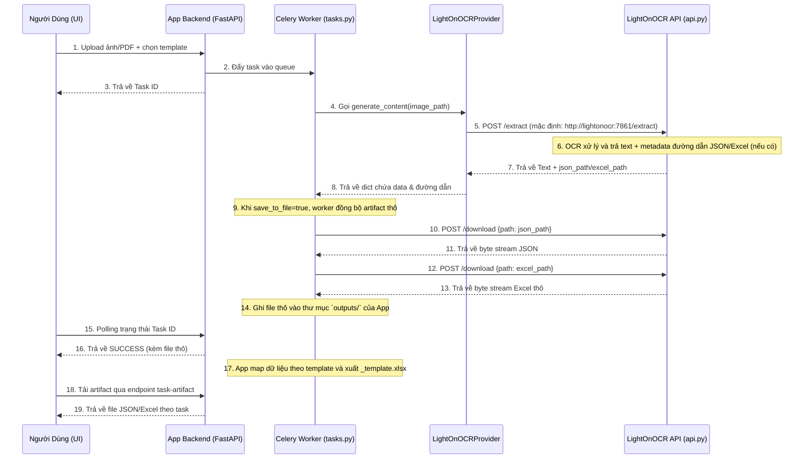

# Kế Hoạch Tích Hợp: Hệ Thống App Chính & LightOnOCR API

Tài liệu này mô tả luồng xử lý (Data Flow) để kết nối hệ thống App chính (`app/`) với server OCR (`LightOnOCR-2-1B/api.py`). Mục tiêu là giữ cấu trúc tách bạch: **App quản lý giao diện + lưu trữ + mapping template**, còn **LightOnOCR tập trung OCR/inference**.

Phiên bản cập nhật: **2026-04-27**

---

## Trạng thái triển khai (As-Is)

| Hạng mục                                        | Trạng thái    | Ghi chú                                                                         |
| ----------------------------------------------- | ------------- | ------------------------------------------------------------------------------- |
| Front UI upload + template chọn nhanh           | ✅ Hoàn thành | Có tại `/ui`, gọi API `/api/v1/extract/json`                                    |
| Settings UI cấu hình agent/base_url/api_key     | ✅ Hoàn thành | Có tại `/ui/settings`, lưu vào `ui-config.json`                                 |
| Celery async task + polling trạng thái          | ✅ Hoàn thành | Dùng `task_id`, poll qua `/api/v1/task-status/{task_id}`                        |
| Tích hợp provider LightOnOCR                    | ✅ Hoàn thành | `LightOnOCRProvider` gọi `POST /extract`                                        |
| Tải artifact JSON/Excel từ OCR qua `/download`  | ✅ Hoàn thành | Worker có luồng tải JSON/Excel khi `save_to_file=true`                          |
| Mapping theo template + xuất Excel template     | ✅ Hoàn thành | Tạo file `_lv1.xlsx` và `_template.xlsx`                                        |
| Download artifact từ app chính                  | ✅ Hoàn thành | Có endpoint `/api/v1/task-artifact/{task_id}/...`                               |
| Chọn folder từ máy người dùng (browser native)  | ⚠️ Một phần   | Hiện dùng nhập `folder_path` phía server, chưa phải folder picker local browser |
| Màn hình fine-tuning dạng chỉnh sửa ô trực tiếp | ⚠️ Một phần   | Đã có download artifact; chưa có UI editor sâu trước khi xuất                   |

---

## Sơ đồ luồng xử lý (Workflow)

---

## Chi tiết theo giai đoạn

### Giai đoạn 1: UI + Trích xuất OCR

1. Front UI có upload ảnh/PDF, chọn template, submit task.
2. Settings UI cho cấu hình agent/base_url/model/api_key/output format.
3. Celery worker nhận task và gọi provider theo cấu hình profile.
4. Khi dùng `lightonocr`, provider gửi multipart request tới `POST /extract`.
5. Mặc định Docker nội bộ dùng endpoint `http://lightonocr:7861/extract`.

### Giai đoạn 2: Đồng bộ artifact + xử lý dữ liệu

1. Worker nhận `json_path`/`excel_path` từ phản hồi OCR API.
2. Worker gọi `POST /download` để kéo artifact về app chính (khi có metadata và bật lưu file).
3. App lưu kết quả trong `outputs/YYYY/MM/DD`.
4. Nếu output là JSON, worker tiếp tục parse, map theo template và build Excel.

### Giai đoạn 3: Trả kết quả cho UI

1. UI poll trạng thái task để lấy kết quả xử lý.
2. Có endpoint tải artifact JSON/Excel, gồm cả bản level-1 và bản template.
3. Chưa có màn hình chỉnh sửa dạng bảng đầy đủ trước khi download (fine-tuning UI nâng cao).

---

## Các mục còn lại theo plan

1. Bổ sung folder picker thân thiện cho end-user (thay vì yêu cầu đường dẫn server).
2. Thêm màn hình fine-tuning trực quan trước khi xuất Excel template.
3. Chuẩn hóa tài liệu kiến trúc để phân biệt rõ luồng `lightonocr` và `local_http`.

## Đánh giá hiện tại

- Ưu điểm: luồng async, tách lớp xử lý OCR, lưu artifact có cấu trúc và hỗ trợ mapping template đã vận hành được.
- Rủi ro còn lại: UX phần folder/fine-tuning chưa hoàn chỉnh theo mục tiêu end-user ban đầu.
